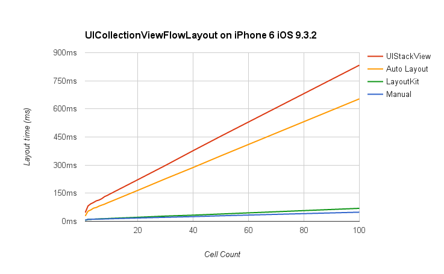

# Benchmarks

This page contains benchmark results for LayoutKit, Auto Layout, and manual layout code.

> LayoutKit is as fast as manual layout code and significantly faster than Auto Layout.

## Methodology

Benchmarks were run on an iPhone 6 running iOS 9.3.2 with Swift optimization turned on.

## UICollectionView

Notes:

- `estimatedItemSize` is [hard to use](http://stackoverflow.com/questions/26143591/specifying-one-dimension-of-cells-in-uicollectionview-using-auto-layout/26349770#26349770) so these tests use `sizeForItemAtIndexPath`.
- UICollectionViewFlowLayout requests the height of all cells during layout (even those that are off screen). This is why layout performance keeps getting worse as number of cells are added to the UICollectionView.

## UITableView

Notes:

- Unlike UICollectionView, UITableView defers asking for the height of cells until it is needed. This is why performance is constant for seven or more cells.
